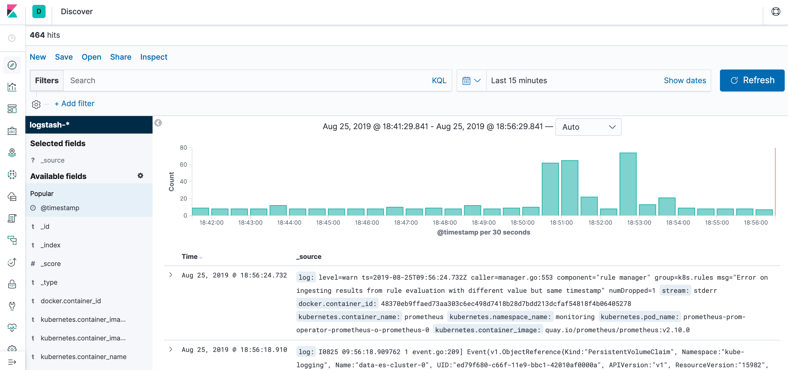

# Deploying the EFK(ElasticSearch, Fluentd, Kibana) and Setting up the log analysis

## Create the logging namespace

Create a namespace for logging.

```
kubectl create ns kube-logging
```

## Deploy the EFK

Run the below command to create all the components.

```
kubectl apply -f deployments/efk/
```
## Verfication

Run below command to verify all the pods. Note that we use only one cluster node. Modify the `replicas` in the `deployments/efk/es-sts.yaml` for multiple nodes if necessary.


```
kubectl -n kube-logging get pods
```

Output

```
NAME                      READY   STATUS    RESTARTS   AGE
es-cluster-0              1/1     Running   0          12h
fluentd-5946j             1/1     Running   0          12h
fluentd-n6t2b             1/1     Running   0          12h
fluentd-qplwn             1/1     Running   0          12h
fluentd-w5lvg             1/1     Running   0          12h
kibana-598dc944d9-p4pxq   1/1     Running   2          12h
```

## Set up the log analysis

Next, run the below command to port-forward the Kibana to local.

```
export POD_NAME=$(kubectl get pods --namespace kube-logging -l "app=kibana" -o jsonpath="{.items[0].metadata.name}")
  kubectl --namespace kube-logging port-forward $POD_NAME 5601
```

Open the web with the browser for verification. The first start may take 10 minutes.

```
http://localhost:5601
```

Then, go to Discover menu item, configure the index to `logstash-*`, choose a @timestamp to create the index pattern. Then we see all the logs from all namespaces in the Kubernetes cluster.




