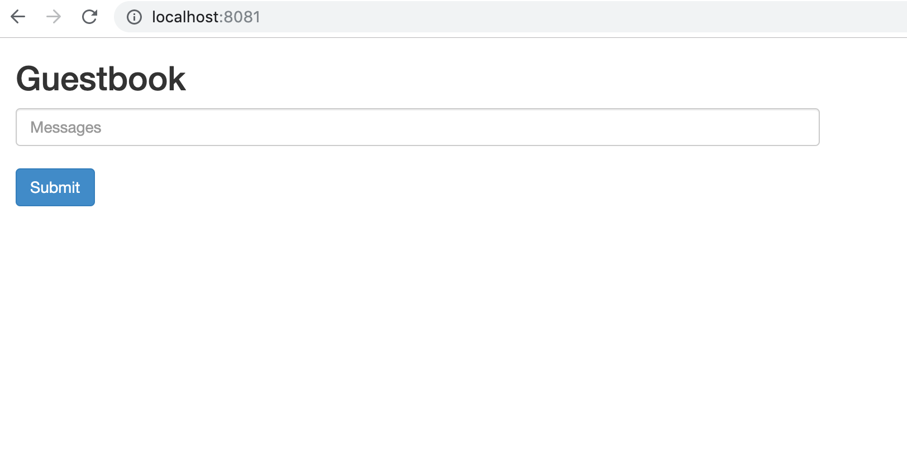

# Deploying the guestbook application with helm from the Jenkins pipeline

## Prerequisites

This part requires that the required tools ( `kubectl` and `helm`) already installed. For the credential to the kuberetes api-sever, use the `./kube/config` fetched at step of [Installing the Helm Tool](03-installing-helm.md).

## Create the jenkins pipeline

1. Create a jenkins pipeline and copy  [pipeline file](../deployments/pipeline/deploy.groovy) as script.

2. Build the pipeline, the output should be like below.

```
Started by user shangkeyun
Running in Durability level: MAX_SURVIVABILITY
[Pipeline] Start of Pipeline
[Pipeline] node
Running on Jenkins in /Users/Shared/Jenkins/Home/workspace/deploy-app
[Pipeline] {
[Pipeline] stage
[Pipeline] { (Prepartion)
[Pipeline] sh
+ kubectl version
Client Version: version.Info{Major:"1", Minor:"12", GitVersion:"v1.12.0", GitCommit:"0ed33881dc4355495f623c6f22e7dd0b7632b7c0", GitTreeState:"clean", BuildDate:"2018-09-27T17:05:32Z", GoVersion:"go1.10.4", Compiler:"gc", Platform:"darwin/amd64"}
Server Version: version.Info{Major:"1", Minor:"14", GitVersion:"v1.14.6", GitCommit:"96fac5cd13a5dc064f7d9f4f23030a6aeface6cc", GitTreeState:"clean", BuildDate:"2019-08-19T11:05:16Z", GoVersion:"go1.12.9", Compiler:"gc", Platform:"linux/amd64"}
[Pipeline] sh
+ helm init --client-only
$HELM_HOME has been configured at /Users/Shared/Jenkins/.helm.
Not installing Tiller due to 'client-only' flag having been set
[Pipeline] sh
+ helm version
Client: &version.Version{SemVer:"v2.14.3", GitCommit:"0e7f3b6637f7af8fcfddb3d2941fcc7cbebb0085", GitTreeState:"clean"}
Server: &version.Version{SemVer:"v2.14.3", GitCommit:"0e7f3b6637f7af8fcfddb3d2941fcc7cbebb0085", GitTreeState:"clean"}
[Pipeline] }
[Pipeline] // stage
[Pipeline] stage
[Pipeline] { (Git clone)
[Pipeline] deleteDir
[Pipeline] sh
+ git clone https://github.com/lanesky/kubernetes-walk-through.git
Cloning into 'kubernetes-walk-through'...
[Pipeline] }
[Pipeline] // stage
[Pipeline] stage
[Pipeline] { (Deploy to dev)
[Pipeline] echo
Creating namespace development if needed
[Pipeline] sh
++ kubectl get ns development -o name
+ '[' '!' -z namespace/development ']'
[Pipeline] sh
+ helm install --name guestbook --namespace development ./kubernetes-walk-through/deployments/charts/guestbook/
NAME:   guestbook
LAST DEPLOYED: Sun Aug 25 15:47:29 2019
NAMESPACE: development
STATUS: DEPLOYED

RESOURCES:
==> v1/Deployment
NAME          READY  UP-TO-DATE  AVAILABLE  AGE
frontend      0/3    3           0          0s
redis-master  0/1    1           0          0s
redis-slave   0/2    2           0          0s

==> v1/Pod(related)
NAME                              READY  STATUS             RESTARTS  AGE
frontend-758b884b46-f6vlw         0/1    ContainerCreating  0         0s
frontend-758b884b46-vhtm9         0/1    ContainerCreating  0         0s
frontend-758b884b46-vt75d         0/1    ContainerCreating  0         0s
frontend-canary-5889b855b8-9srjv  1/1    Running            0         15h
redis-master-596696dd4-lrlql      0/1    ContainerCreating  0         0s
redis-slave-96685cfdb-7nfbf       1/1    Terminating        0         15h
redis-slave-96685cfdb-8h8l9       0/1    ContainerCreating  0         0s
redis-slave-96685cfdb-k72vk       1/1    Terminating        0         15h
redis-slave-96685cfdb-sg9ph       0/1    ContainerCreating  0         0s

==> v1/Service
NAME          TYPE       CLUSTER-IP      EXTERNAL-IP  PORT(S)       AGE
frontend      NodePort   10.104.205.24   <none>       80:31612/TCP  0s
redis-master  ClusterIP  10.99.185.42    <none>       6379/TCP      0s
redis-slave   ClusterIP  10.108.109.229  <none>       6379/TCP      0s


NOTES:
1. Get the application URL by running these commands:
  export NODE_PORT=$(kubectl get --namespace development -o jsonpath="{.spec.ports[0].nodePort}" services guestbook)
  export NODE_IP=$(kubectl get nodes --namespace development -o jsonpath="{.items[0].status.addresses[0].address}")
  echo http://$NODE_IP:$NODE_PORT

[Pipeline] }
[Pipeline] // stage
[Pipeline] }
[Pipeline] // node
[Pipeline] End of Pipeline
Finished: SUCCESS
```

## Verfication

Port-forward the guestbook application to local and show it in browser `http://localhost:8081`.

```
kubectl -n development port-forward svc/frontend 8081:80
```



