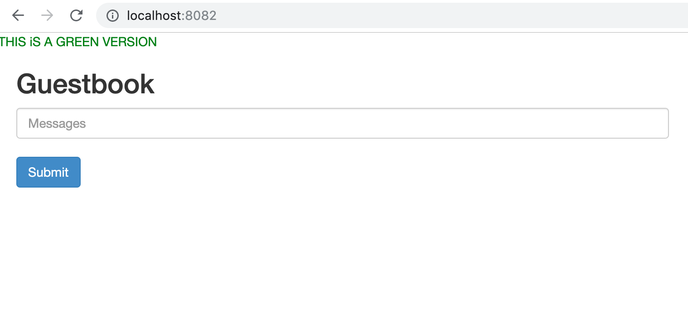
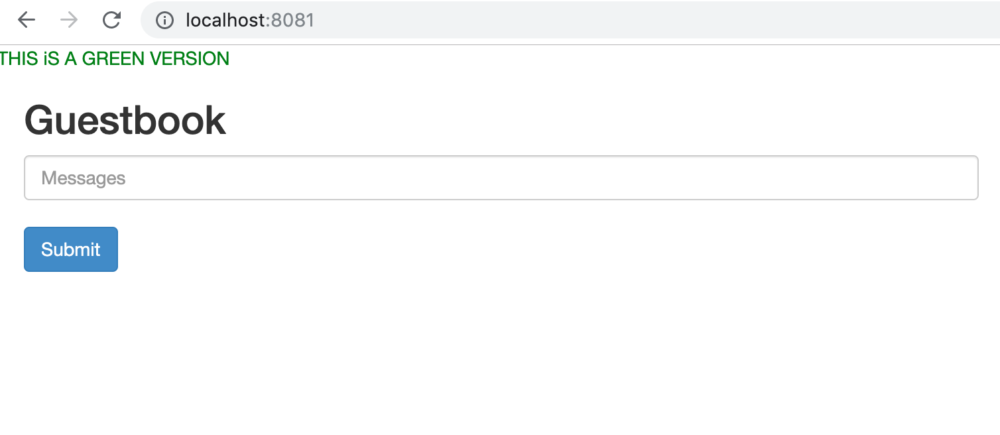

# Demonstrating the Blue/Green deployment


In this step we use the guestbook application to demonstrate the blue/greend deployment.

## Show the current version (blue)

Port-forward the current version (blue version) to local and show it in browser `http://localhost:8081`.

```
kubectl -n development port-forward svc/frontend 8081:80
```


Run below common to check the pods for current version (blue version).

```
kubectl -n development get pods
```

```
NAME                           READY   STATUS    RESTARTS   AGE
frontend-758b884b46-9cpzx      1/1     Running   0          14m
frontend-758b884b46-f6n25      1/1     Running   0          14m
frontend-758b884b46-pgshd      1/1     Running   0          14m
...
```

## Deploy the green version

Run below command to deploy the green version. Note that we add a deployment for green version and it doesn't affect the current version.

```
kubectl -n development apply -f deployments/guestbook/green-deploy.yaml
```

Check the new pods generated with the green version deployment.

```
kubectl -n development get pods
```

```
NAME                              READY   STATUS    RESTARTS   AGE
frontend-758b884b46-9cpzx         1/1     Running   0          27m
frontend-758b884b46-f6n25         1/1     Running   0          27m
frontend-758b884b46-pgshd         1/1     Running   0          27m
frontend-green-77f46d54bd-2sj9l   1/1     Running   0          11s
frontend-green-77f46d54bd-thh7v   1/1     Running   0          11s
frontend-green-77f46d54bd-twg59   1/1     Running   0          11s
...
```

Port-forward one of the green version pods to local and check with browser.

```
kubectl -n development port-forward frontend-green-77f46d54bd-2sj9l 8082:80
```



## Shift the version from blue to green

Edit the service of frontend.

```
kubectl -n development edit svc  frontend
```

Note that the selector contains a version of `4`. We eplace ith with `5` and it will redirect the service to the pods of green version.

```
# Please edit the object below. Lines beginning with a '#' will be ignored,
# and an empty file will abort the edit. If an error occurs while saving this file will be
# reopened with the relevant failures.
#
apiVersion: v1
kind: Service
metadata:
  creationTimestamp: 2019-08-25T07:33:55Z
  labels:
    app: guestbook
    tier: frontend
  name: frontend
...
  selector:
    app: guestbook
    tier: frontend
    version: "4"
...
```

Finish the editing.

``` 
 service/frontend edited
```

Then we run port-forward again and verify the green version is reflected.


```
kubectl -n development port-forward svc/frontend 8081:80
```




