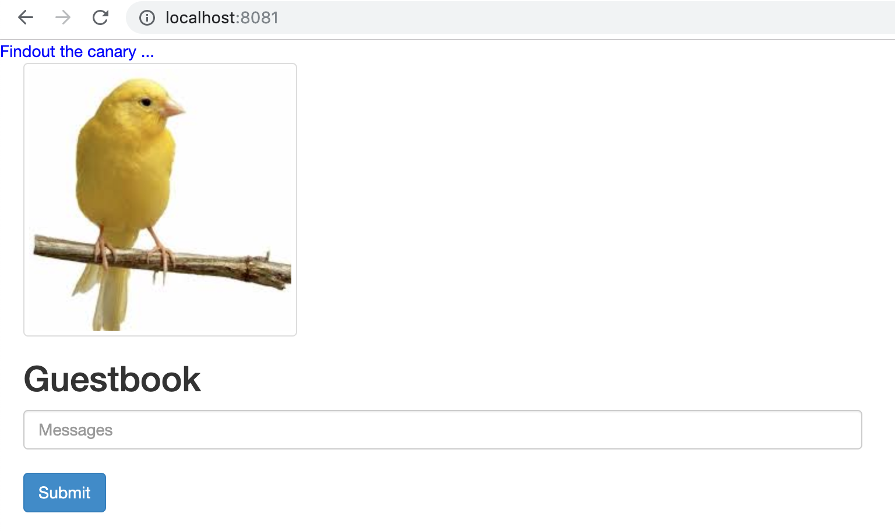

# Demonstrating the Canary release


In the step we are going to inject a canary version into the normal version. The service forward the request to both the normal and canary version.


## The deployment of normal version

Note that the `replicas` is `3` and `track` is `stable`.

```
kind: Deployment
metadata:
  name: frontend-green
spec:
  selector:
    matchLabels:
      app: guestbook
      tier: frontend
      track: stable
      version: "5"
  replicas: 3
  template:
    metadata:
      labels:
        app: guestbook
        tier: frontend
        track: stable
        version: "5"
    spec:
      containers:
      - name: php-redis
        image: shangkeyun/guestbook:v5
        imagePullPolicy: Always
        resources:
          requests:
            cpu: 100m
            memory: 100Mi
        env:
        - name: GET_HOSTS_FROM
          value: dns
          # If your cluster config does not include a dns service, then to
          # instead access environment variables to find service host
          # info, comment out the 'value: dns' line above, and uncomment the
          # line below:
          # value: env
        ports:
        - containerPort: 80
```

## The deployment of canary version

Note that the `replicas` is `1` and `track` is `canary`.

```
apiVersion: apps/v1 #  for k8s versions before 1.9.0 use apps/v1beta2  and before 1.8.0 use extensions/v1beta1
kind: Deployment
metadata:
  name: frontend-canary
spec:
  selector:
    matchLabels:
      app: guestbook
      tier: frontend
      track: canary
      version: "5"
  replicas: 1
  template:
    metadata:
      labels:
        app: guestbook
        tier: frontend
        track: canary
        version: "5"
    spec:
      containers:
      - name: php-redis
        image: shangkeyun/guestbook:v6
        imagePullPolicy: Always
        resources:
          requests:
            cpu: 100m
            memory: 100Mi
        env:
        - name: GET_HOSTS_FROM
          value: dns
          # If your cluster config does not include a dns service, then to
          # instead access environment variables to find service host
          # info, comment out the 'value: dns' line above, and uncomment the
          # line below:
          # value: env
        ports:
        - containerPort: 80
```


## The service

Run below command to export the service definition.

```
kubectl -n development get svc frontend -o yaml --export
```

Note that the sevice uses the selector of `app`, `tier` and `version` to map the pods for forwaring the traffic. Since the selector is totally same for the deployments of normal version cand canary version, the traffic will be forwarded no matter what the version is.

```
apiVersion: v1
kind: Service
metadata:
  creationTimestamp: null
  labels:
    app: guestbook
    tier: frontend
  name: frontend
  selfLink: /api/v1/namespaces/development/services/frontend
spec:
  externalTrafficPolicy: Cluster
  ports:
  - port: 80
    protocol: TCP
    targetPort: 80
  selector:
    app: guestbook
    tier: frontend
    version: "5"
  sessionAffinity: None
  type: NodePort
status:
  loadBalancer: {}
```


## Deploy the canary version

Run below command to deploy the canary version.

```
kubectl -n development apply -f deployments/guestbook/canary-deploy.yaml
```

Check the pods.

```
kubectl -n development get pods -l app=guestbook,tier=frontend,version=5
```

Output

```
NAME                               READY   STATUS    RESTARTS   AGE
frontend-canary-694dc48fcd-xdf2d   1/1     Running   0          56s
frontend-green-77f46d54bd-2sj9l    1/1     Running   0          39m
frontend-green-77f46d54bd-thh7v    1/1     Running   0          39m
frontend-green-77f46d54bd-twg59    1/1     Running   0          39m
```

Port-forward to local to check the effect.

```
kubectl -n development port-forward svc/frontend 8081:80
```



***Note***

The port-forward may not reflect the canary version due to the traffic is not enough. In this case you can delete the deployment of normal version and port-forward again to verify the canary version.

```
kubectl -n development delete deploy frontend-green
```
